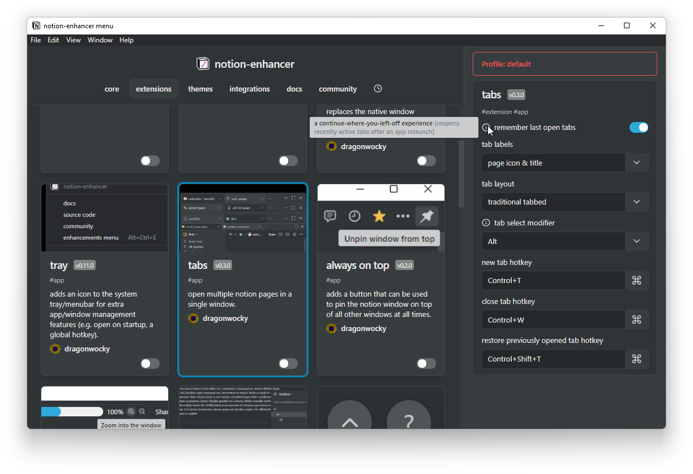

# Basic Usage

When you first open Notion after installing the notion-enhancer,
not much will have changed. The only noticeable difference should
be an extra option in the Notion sidebar labelled
**{.inline-icon .mx-1} notion-enhancer**.
Clicking this will open the notion-enhancer menu, the entry point
to all notion-enhancer features and configuration.

## Configuration

### Mods

When the notion-enhancer menu opens, you will see an overview of available
mods. These summaries will explain the overall functionality of the mod,
but to see the specific features of a mod - click on it! Clicking on a mod
will open its options in the sidebar. The available options will provide
a variety of appearances and uses for every mod, and often can be hovered
over to bring up additional information about what they do. To enable
a mod, click the toggle on it.

There are 4 different types of mods that come with the notion-enhancer:

- **Core** mods provide the basics required for everything else to work.
  Though they can't be disabled, they can be configured (e.g. custom hotkeys
  for opening the menu or the extra sidebar used in some notion-enhancer mods).

- **Extensions** build on the functionality and layout of the Notion client,
  modifying and interacting with existing interfaces. These are the mods that
  come with the most features and the most configuration.

- **Themes** change Notion's colour scheme. You can only pick one dark or one
  light theme at a time.

- **Integrations** are extensions that use an unofficial API to access and
  modify Notion content. These mods are particularly powerful but potentially
  dangerous.

The majority of mods are available in any environment the notion-enhancer runs in.
There are a few, however, that are only available in certain environments. These
usually addresss problems specific to that environment (e.g. adding a graphical
zoom in/out slider to the app) or are only possible in that environment (e.g. tabs).

You can check out all the available mods for the notion-enhancer on the
[Features](./features.md) page - the best way to see what the notion-enhancer can do,
though, is to download it and try it out!

### Profiles

The notion-enhancer makes it easy to switch between different preconfigurations
and even export and import configurations for use in different environments
or installations, or even by different users of the notion-enhancer.
This is possible through the profiles feature.

At the top of the sidebar in the notion-enhancer menu is a button that should say
**Profile: default**. Clicking on this will open the profile options - a select,
an input, and 4 buttons.

- The select allows you to pick from existing profiles or create a new profile.
- The input lets you name or rename the currently selected profile.
- The download button will export the currently selected profile as a `.json` file.
- The upload button will allow selection of a `.json` file that will be uploaded to override
  the currently selected profile.
- The save button will save your changes and reload Notion to load the new profile.
- The delete button will delete the currently selected profile.

## FAQ

If you have any questions that aren't answered anywhere on this website,
the best place to find help is our community [Discord](https://discord.gg/sFWPXtA).

- _Why aren't themes working?_

  Dark themes will only be applied when Notion is in dark mode,
  and light themes will only be applied when Notion is in light mode.
  To change your Notion theme, go to **Settings and Members → Appearance**
  within Notion and pick either "Light", "Dark" or "Use system setting".

- _Is this against Notion's Terms of Service? Can I get in trouble for using it?_

  Definitely not! Before releasing the notion-enhancer, we checked with Notion's
  support team and received the following responses.

  > "Userscripts and userstyles are definitely cool ideas and would be helpful for many users!"
  >
  > "If you use notion-enhancer, you are not breaking the TOS."
